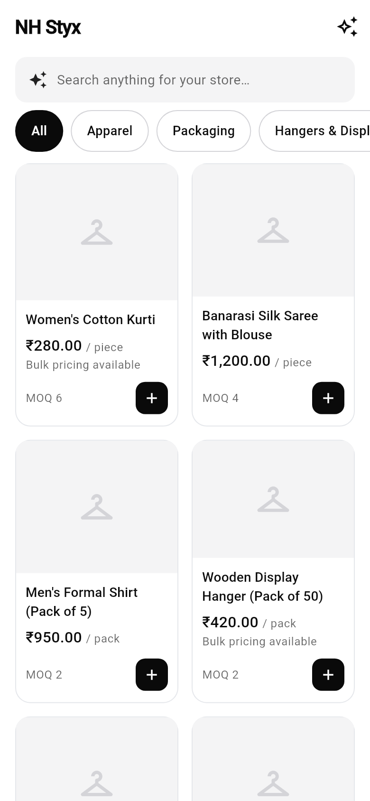
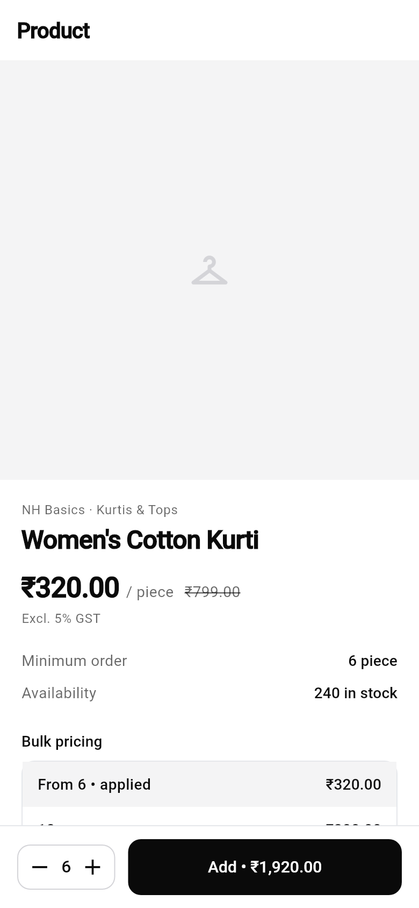
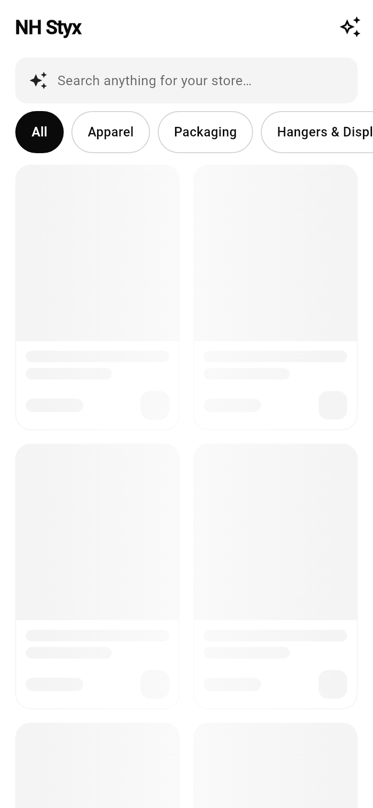

# NH Styx — Customer App

The Flutter mobile app for **garment store & boutique owners** to browse the wholesale catalog, build a cart, and place orders — everything their store needs in one place.

**Design:** minimal, modern, monochrome storefront — a 2-column product grid, category rail, product detail pages, and **AI-powered natural-language search** (“cotton kurtis under ₹300”).

**Stack:** Flutter · Riverpod (state) · go_router (navigation) · Dio (HTTP) · flutter_secure_storage (tokens).

---

## Screenshots

| Shop | Product detail | AI search | Loading (skeletons) |
|------|----------------|-----------|---------------------|
|  |  |  |  |

---

## ⚠️ First-time setup

This repository contains the Dart source and project config. The platform
folders (`android/`, `ios/`, `web/`, etc.) are **not** committed — generate them
once with Flutter, which preserves `lib/`, `test/`, and `pubspec.yaml`:

```bash
flutter create .          # regenerates platform folders in place
flutter pub get
```

Then run against a locally-running backend:

```bash
# Android emulator (reaches host at 10.0.2.2 — the default):
flutter run

# iOS simulator / web / desktop (override the API URL):
flutter run --dart-define=API_BASE_URL=http://localhost:4000/api/v1
```

Sign in with the seeded customer account (**phone + password**):

| Phone        | Password       |
|--------------|----------------|
| `9876543210` | `Customer@123` |

> Or tap **Register your store** to create a new boutique account.
> Prices are shown in ₹ (the API uses integer paise); GST is computed at
> checkout from your delivery state. The cart lives server-side.

---

## Architecture

Feature-first, with a light data → domain → presentation split per feature:

```
lib/
├── main.dart                       # ProviderScope + app bootstrap
└── src/
    ├── app.dart                    # MaterialApp.router + theme
    ├── core/
    │   ├── config/app_config.dart  # API base URL (dart-define)
    │   ├── network/                # Dio client (+ auth/refresh), ApiException
    │   ├── router/app_router.dart  # go_router + auth redirect
    │   ├── storage/token_storage.dart  # secure token storage
    │   └── theme/app_theme.dart    # Material 3 theme
    ├── features/
    │   ├── auth/                    # phone login, register, session controller
    │   ├── products/               # grid storefront, product detail (paise, tiers)
    │   ├── categories/             # category tree + rail filter
    │   ├── search/                 # AI natural-language search
    │   ├── cart/                    # server-side cart + checkout panel
    │   ├── addresses/              # delivery addresses (+ add screen)
    │   ├── orders/                  # GST checkout + order history
    │   ├── profile/                # account + sign out
    │   └── home/                    # bottom-nav shell (Shop·Cart·Orders·Profile)
    └── shared/                      # formatters (paise→₹), reusable widgets
test/
├── domain_test.dart                # product/cart parsing + money formatting
├── shop_screen_test.dart           # storefront renders (search/rail/grid)
└── widget_test.dart                # login screen smoke test

> **AI search** calls the backend `POST /search/ai`, which uses Claude to
> parse the query when an `ANTHROPIC_API_KEY` is configured (keyword fallback
> otherwise). The Shop tab's search bar opens this experience.
```

### State management (Riverpod)
- `authControllerProvider` — `AsyncNotifier<Customer?>`; restores the session on
  launch, exposes `login(phone, password)` / `register` / `logout`.
- `productsProvider` — `FutureProvider`, reactive to `productSearchProvider`.
- `cartControllerProvider` — `AsyncNotifier<Cart>` backed by the server cart,
  with a derived `cartCountProvider` for the nav badge.
- `addressesProvider` / `defaultAddressProvider` — delivery addresses.
- `checkoutControllerProvider` / `ordersProvider` — place orders & list history.

### Networking
`Dio` injects the bearer token on every request and performs a single
refresh-and-retry when the API returns `401`.

---

## Scripts

```bash
flutter pub get        # install dependencies
flutter analyze        # static analysis / lints
flutter test           # run unit tests
flutter run            # launch on a device/emulator
flutter build apk      # release Android build
```
